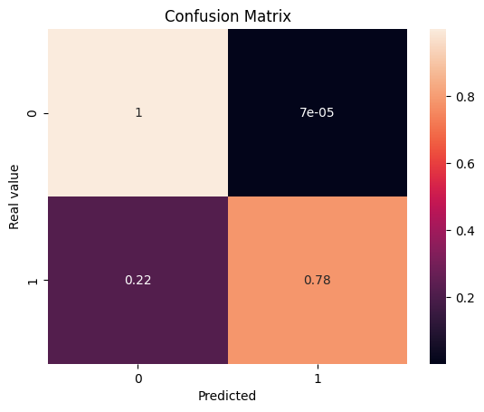

# Model Card

Decision tree to detect fraudulent transactions

## Model Description

**Input:** 28 decimal features, amount and time 

**Output:** Binary output if transaction is genuine or fraudulent.

**Model Architecture:** A decision tree using sklearn.tree

## Performance

Classification report:
precision    recall  f1-score   support

           0       1.00      1.00      1.00     14209
           1       0.96      0.78      0.86        32

    accuracy                           1.00     14241
   macro avg       0.98      0.89      0.93     14241
weighted avg       1.00      1.00      1.00     14241 

Confusion matrix:

## Limitations

As the class is highly imbalanced, it would be better measuring the accuracy using the Area Under the Precision-Recall Curve (AUPRC).

## Trade-offs

Logistical regression would give much better result and would outperform Decision tree, but would be less understandable for the user.
